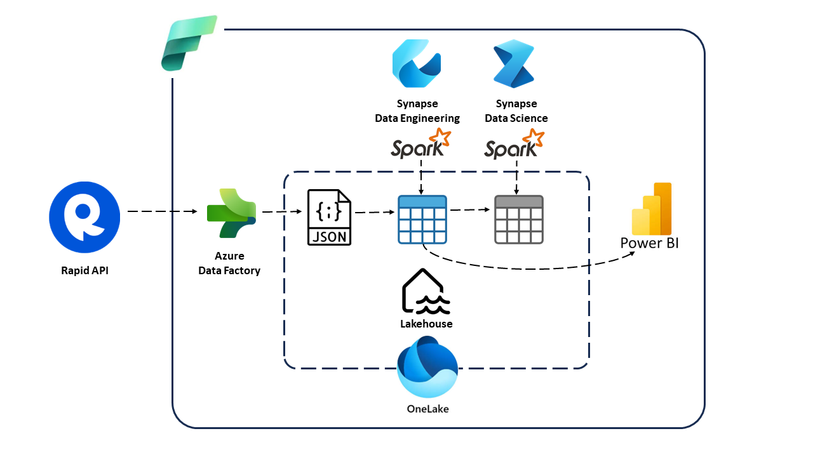
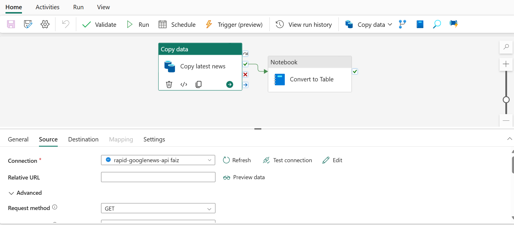
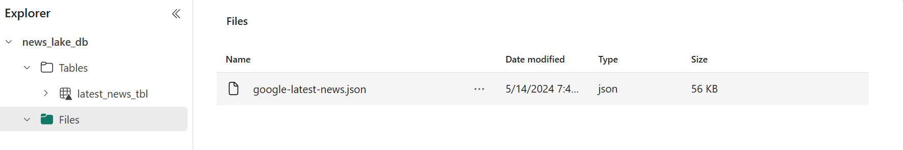
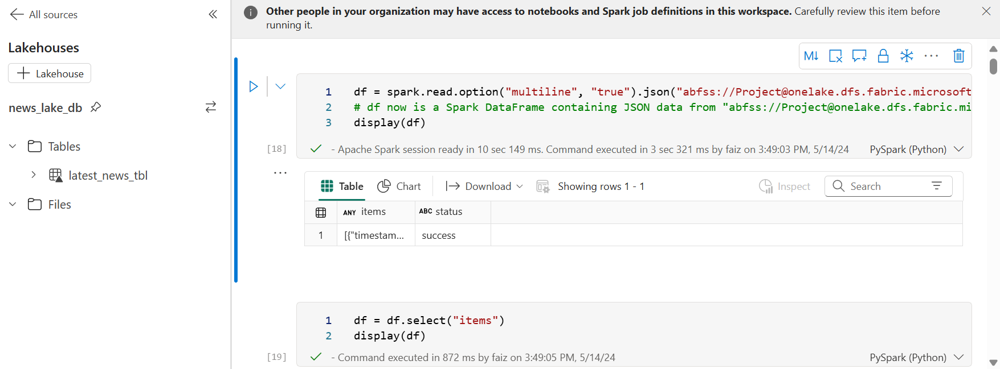
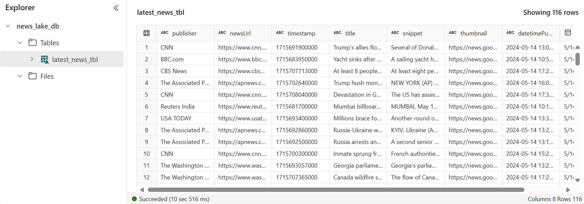
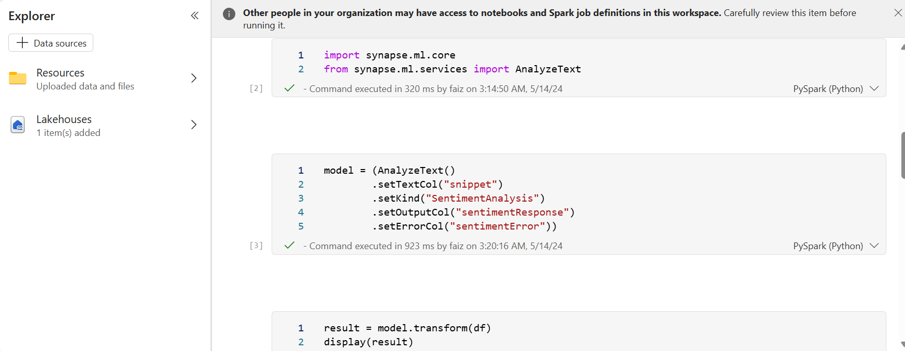
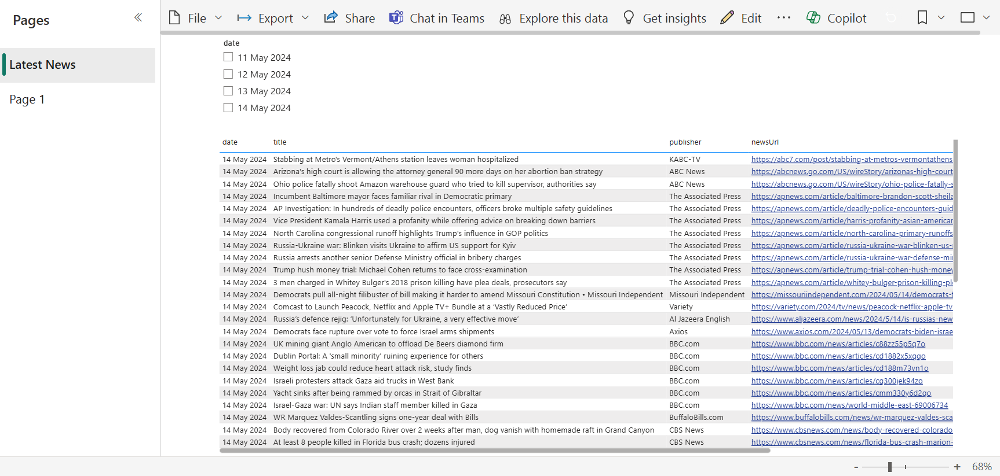
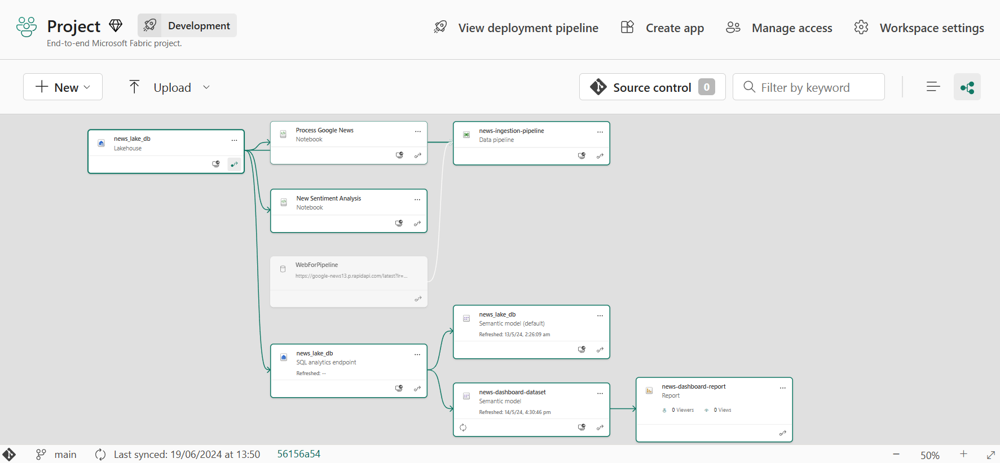

# Introduction 
Microsoft Fabric is an end-to-end, unified analytics platform introduced by Microsoft in May 2023. It is designed to integrate various data and analytics capabilities, providing a seamless experience for data engineers, data scientists, business analysts, and other data professionals. This project was designed keeping in mind a possible real-world use-case incorporating various experiences, tools, and techniques provided by Fabric.

# Project Description
<ul>
  <li>In this project, using Azure Data Factory the Google news API from RapidAPI with the necessary parameters was used to fetch the latest news, the result was stored in the .json format in the files section of the 'news_lake_db' lakehouse.</li>
 

 
<li>Using the 'Process Google News' Spark notebook, the relevant info from the JSON was converted into the tabular format and stored in the tables section of the same lakehouse, Type1 SCD technique was also incorporated.</li>
 

 
<li>In the 'New Sentiment Analysis' Spark notebook, the inbuilt function for sentiment analysis from Synapse ML services was then used to get the sentiment from the short descriptions of various news articles present in the table. Currently, its result is not processed further as the AnalyzeText() function is currently not supported in the Western European region.</li>
 

 
<li>The output table generated by the 'Process Google News' Spark notebook was then visualized using the PowerBI service using the relevant slicers and visuals.</li>
 

 
<li>All the items in this workspace are part of the 'Development' stage of the Deployment pipeline, it has two more stages i.e. 'Test' and 'Production'. The items are also version-controlled using Git in Azure DevOps Repos, this GitHub repository is a copy of that repository.</li>
 

</ul>
